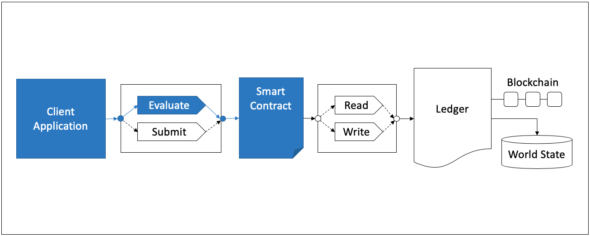
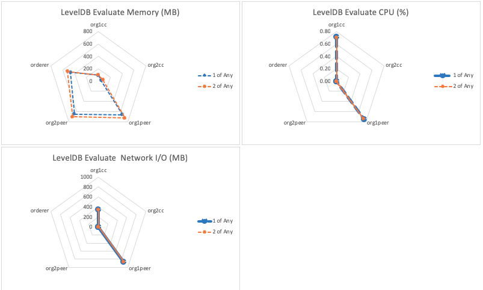
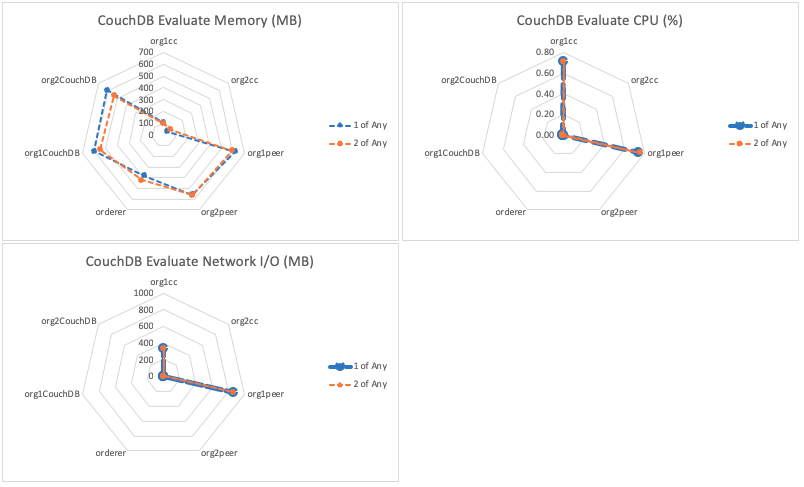
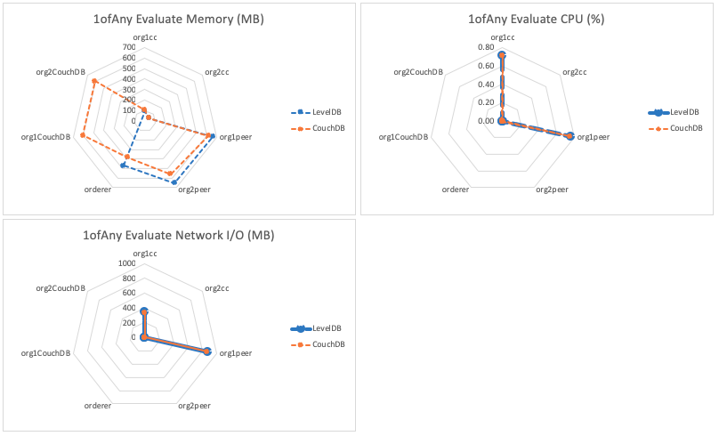
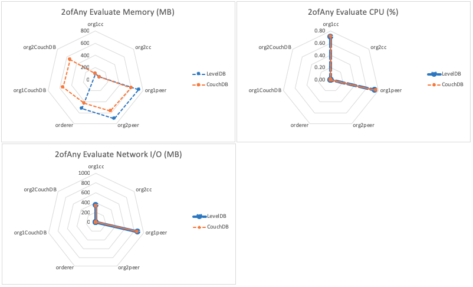

The Empty Contract Benchmark consists of evaluating `emptyContract` gateway transactions for the fixed-asset smart contract deployed within LevelDB and CouchDB networks. This will result on the transaction being run on a single Hyperledger Fabric Peer and will not result in any interaction with the Orderer, resulting in the transaction pathway depicted in Figure 1.

*Figure 1: Evaluate Transaction Pathway*

This is repeated for networks that use the following endorsement policies:
 
 - 1-of-any
 - 2-of-any

Achievable throughput and associated latencies are investigated through maintaining a constant transaction backlog of 15 transactions for each of the test clients.

Resource utilization is investigated for fixed TPS rate of 750TPS.

## Benchmark Results

*LevelDB- evaluate transactions with varying endorsement policy*

| Type | Policy | Max Latency (s) | Avg Latency (s) | Throughput (TPS) |
| ---- | ------ | --------------- | --------------- | ---------------- |
| evaluate | 1-of-any | 0.18 | 0.04 | 792.3 |
| evaluate | 2-of-any | 0.18 | 0.04 | 796.4 |

*CouchDB- evaluate transactions with varying endorsement policy*

| Type | Policy | Max Latency (s) | Avg Latency (s) | Throughput (TPS) |
| ---- | ------ | --------------- | --------------- | ---------------- |
| evaluate | 1-of-any | 0.16 | 0.04 | 789.9 |
| evaluate | 2-of-any | 0.17 | 0.04 | 797.5 |

*LevelDB Resource Utilization– Evaluate By Policy @750TPS*

*CouchDB Resource Utilization– Evaluate By Policy @750TPS*

*Resource Utilization– Evaluate 1ofAny Policy @750TPS*

*Resource Utilization– Evaluate 2ofAny Policy @750TPS*

## Benchmark Observations
With a fixed world state database, the endorsement policy has no impact on the consumed resources when evaluating gateway transactions.

In comparing a LevelDB world state database with a CouchDB equivalent, there is no appreciable difference in the achievable transaction throughput or transaction latency, nor the CPU or network I/O consumed by either implementation when varying the endorsement policy. There is a slight cost in additional memory requirements for the use of a CouchDB world state store.