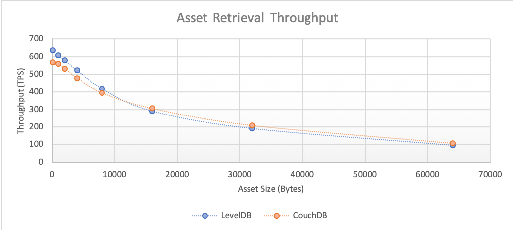
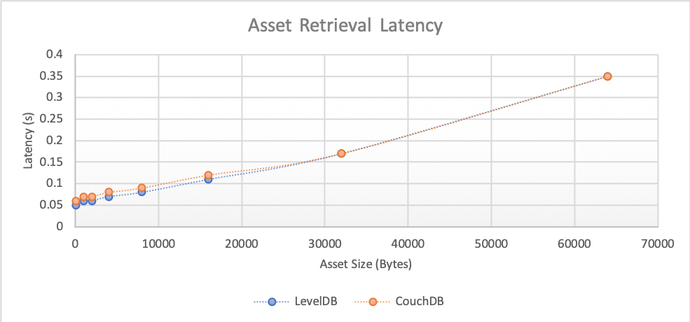
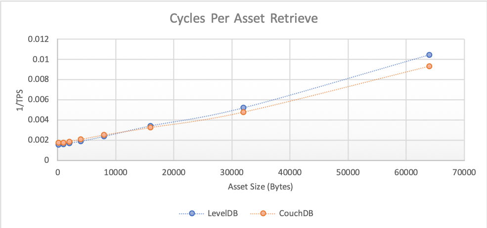
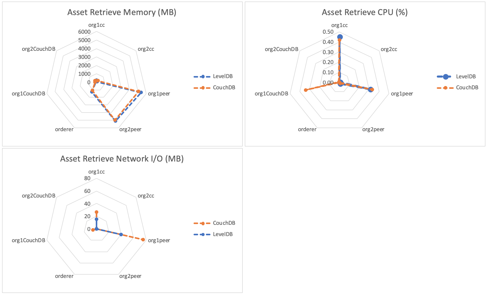

The asset retrieval benchmark consists of evaluating `getAsset` gateway transactions for the fixed-asset smart contract deployed within LevelDB and CouchDB networks that uses a 2-of-any endorsement policy. This will result in the method being run on a single Hyperledger Fabric Peer and will not result in any interaction with the Orderer. The investigated scenarios are targeted at reading from the world state database, resulting in the transaction pathway depicted in Figure 1.

*Figure 1: Evaluate Transaction Pathway*

Each transaction retrieves a single asset with a randomised UUID from the world state database.

Achievable throughput and associated latencies are investigated through maintaining a constant transaction backlog for each of the test clients. Successive rounds increase the size of the asset retrieved from the world state database.

Resource utilization is investigated for a fixed transaction rate of 350TPS, retrieving assets of size 8Kb.

## Benchmark Results

*LevelDB*

| Asset Size (bytes) | Max Latency (s) | Avg Latency (s) | Throughput (TPS) |
| ------------------ | --------------- | --------------- | ---------------- |
| 100 | 0.34 | 0.05 | 636.0 |
| 1k | 0.21  | 0.06 | 611.1 |
| 2k | 0.23 | 0.06 | 579.8 |
| 4k | 0.20 | 0.07 | 516.8 |
| 8k | 0.19 | 0.08 | 423.1 |
| 16k | 0.24 | 0.11 | 293.6 |
| 32k | 0.35 | 0.18 | 186.5 |
| 64k | 0.73 | 0.35 | 96.0 |

*CouchDB*

| Asset Size (bytes) | Max Latency (s) | Avg Latency (s) | Throughput (TPS) |
| ------------------ | --------------- | --------------- | ---------------- |
| 100 | 1.10 | 0.06 | 567.4 |
| 1K | 1.06 | 0.07 | 558.9 |
| 2K | 0.24 | 0.07 | 531.4 |
| 4K | 0.25 | 0.08 | 478.0 |
| 8K | 0.26 | 0.09 | 395.4 |
| 16K | 0.29 | 0.12 | 306.1 |
| 32K | 0.36 | 0.17 | 208.3 |
| 64K | 0.75 | 0.35 | 107.0 |

*Resource Utilization- 8k Assets @350TPS*

## Benchmark Observations
The CouchDB world state database is observed to achieve comparable throughput and lower latencies than a LevelDB equivalent, with higher achievable TPS for assets that are larger than 10Kb.

In comparing a LevelDB world state database with a CouchDB equivalent during asset retrieval, both consume similar memory resources, though the CouchDB world state database results in greater network I/O and a CPU overhead for the CouchDB instance that is not offset at the peer.