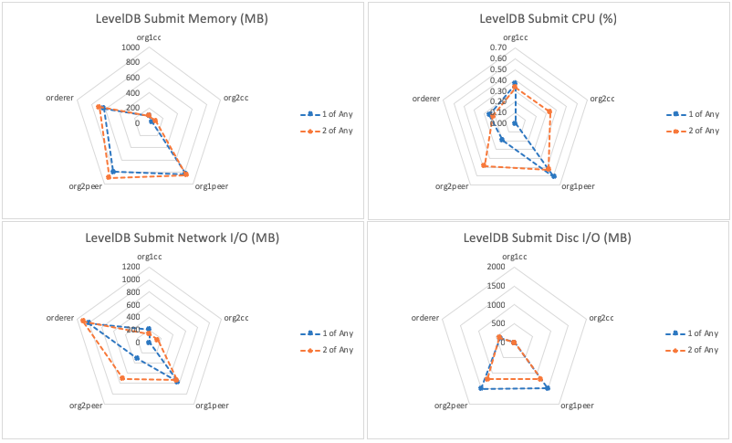
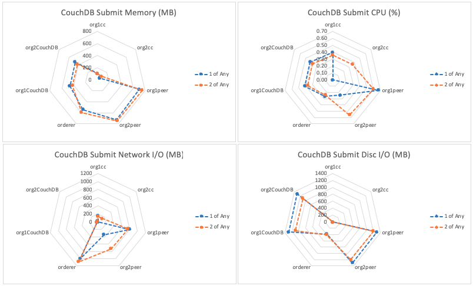
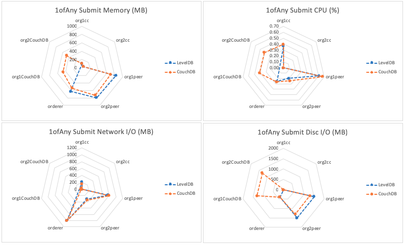
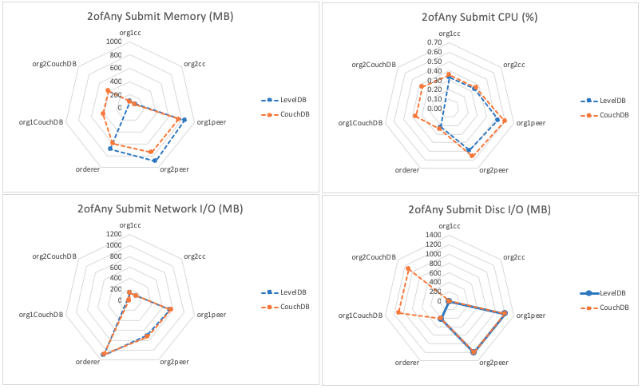

The Empty Contract Benchmark consists of submitting `emptyContract` gateway transactions for the fixed-asset smart contract deployed within LevelDB and CouchDB networks. When submitting `emptyContract` gateway transactions, the interaction is recorded on the ledger. This results in the transaction pathway as depicted in Figure 1.

*Figure 1: Submit Empty Contract Transaction Pathway*

This is repeated for networks that use the following endorsement policies:
 
 - 1-of-any
 - 2-of-any

Achievable throughput and associated latencies are investigated through maintaining a constant transaction backlog of 15 transactions for each of the test clients.

Resource utilization is investigated for fixed TPS rate of 350TPS.

## Benchmark Results

 *LevelDB- submit transactions with varying endorsement policy*

| Type | Policy | Max Latency (s) | Avg Latency (s) | Throughput (TPS) |
| ---- | ------ | --------------- | --------------- | ---------------- |
| submit | 1-of-any | 0.41 | 0.09 | 485.4 |
| submit | 2-of-any | 0.33 | 0.10 | 420.0 |

*CouchDB- submit transactions with varying endorsement policy*

| Type | Policy | Max Latency (s) | Avg Latency (s) | Throughput (TPS) |
| ---- | ------ | --------------- | --------------- | ---------------- |
| submit | 1-of-any | 0.52 | 0.11 | 380.5 |
| submit | 2-of-any | 0.32 | 0.13 | 3387 |

*LevelDB Resource Utilization– Submit By Policy @750TPS*

*CouchDB Resource Utilization– Submit By Policy @750TPS*

*Resource Utilization– Submit 1ofAny Policy @750TPS*

*Resource Utilization– Submit 2ofAny Policy @750TPS*

## Benchmark Observations
LevelDB is observed to be beneficial for achievable throughput and reduced latencies in comparison to CouchDB during submission of an `emptyContract` gateway transaction for both investigated endorsement policies.

With a fixed world state database, the endorsement policy is observed to impact the consumed resources when submitting a transaction. Increasing the number of required endorsements is observed to increase the CPU and network I/O, through inclusion of additional peers and smart contract containers required to participate in each transaction.

In comparing a LevelDB world state database with a CouchDB equivalent, only the network I/O is observed to be equivalent when varying the endorsement policy. There is an observed penalty in additional memory, CPU and disc I/O requirements for the use of a CouchDB world state for the network as a whole, though the memory requirements of the peers are reduced.