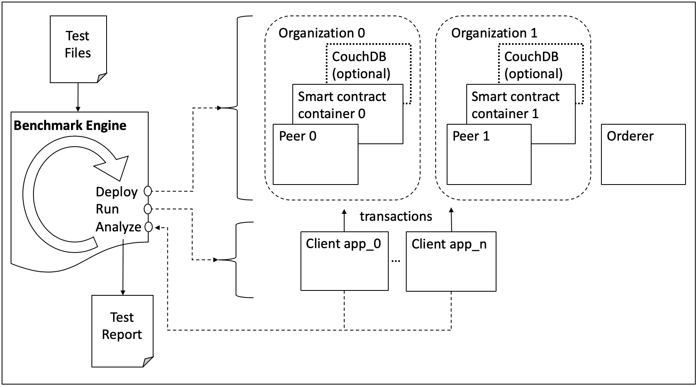
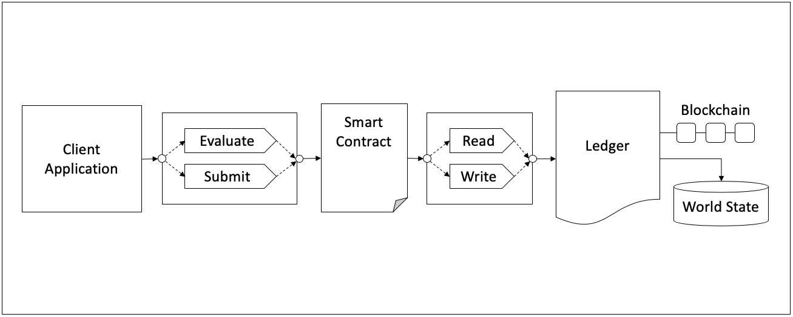

Hyperledger Fabric performance observations are obtained from testing smart contracts, driven by Fabric-SDK-Node clients through a series of benchmarks; the test topology is given in Figure 1 below

*Figure 1: Test Topology*

During benchmarking, all transactions are driven via a Hyperledger Fabric client gateway. Throughput and latencies for each benchmark are measured, as are resource statistics during the benchmark process.

## The Smart Contract
All benchmarks are facilitated by the `fixed-asset` smart contract that is deployed to the Hyperledger Fabric network. The smart contract facilitates the driving of core API methods that are commonly used by a smart contract developer.

| Smart Contract Method | Description|
| --------------------- | -----------|
| emptyContract         | Immediately returns an empty response and represents the minimum possible overhead incurred through evaluation or submission of a smart contract method via a gateway. |
| createAsset | Performs a single `putState()` operation, inserting an asset of defined byte size into the World State database. |
| createAssetsFromBatch | Performs multiple `putState()` operations over an array of assets, inserting each into the World State database. |
| getAsset | Performs a single `getState()` operation, extracting and returning a single asset from the World State database using a passed UUID. |
| getAssetsFromBatch | Performs multiples `getState()` operations over an array of asset UUIDs, extracting and returning all asset from the World State database. |
| paginatedRangeQuery | Performs a `getStateByRangeWithPagination()` operation, based on passed start/end keys, a desired page size and passed bookmark. The records obtained from the query are processed and returned in a JSON response that also includes a new bookmark. |
| paginatedRichQuery | Performs a `getQueryResultWithPagination()` operation, based on a passed Mango query string, a desired page size and bookmark. The records obtained from the query are processed and returned in a JSON response that also includes a new bookmark. Only valid for deployments including a CouchDB World State database. |

Smart contract methods may be evaluated or submitted via a Fabric Network gateway. An overview of possible transaction pathways from a client application interacting with Hyperedger Fabric is presented in Figure 1.

Evaluation of a smart contract method will not include interaction with the ordering service, and consequently will not result in appending to the leger; submission of a smart contract will result on the method being run on Hyperledger Fabric Peers as required by the endorsement policy and appended to the ledger by the ordering service.

*Figure 1: Possible Transaction Pathways*

## Smart Contract Benchmarks
The complete output of the benchmark runs, and the resources used to perform them, are in the resources section of the Appendix. All benchmarks are driven at maximum possible TPS for a duration of 5 minutes by multiple test clients. This is followed by a driving the benchmarks at a set TPS for a duration of 5 minutes by multiple test clients to enable resource utilization comparisons. The benchmarks comprise of:

| Benchmark | Config Files | Description |
| --------- | ------------ | ----------- |
| Empty Contract | empty-contract-1of.yaml, empty-contract-2of.yaml | Evaluates and submits `emptyContract` gateway transactions for the fixed-asset smart contract. This transaction performs no action. Repeated for different Endorsement Policies. |
| Create Asset | create-asset.yaml | Submits `createAsset` gateway transactions for the fixed-asset smart contract. Each transaction inserts a single asset into the world state database. Successive rounds increase the asset byte size inserted into the world state database. |
| Create Asset Batch | create-asset-batch.yaml | Submits `createAssetsFromBatch` gateway transactions for the fixed-asset smart contract. Each transaction inserts a sequence of fixed size assets into the world state database. Successive rounds increase the batch size of assets inserted into the world state database. |
| Get Asset | get-asset.yaml | Evaluates `getAsset` gateway transactions for the fixed-asset smart contract. Each transaction retrieves a single asset from the world state database. Successive rounds increase the asset byte size retrieved from the world state database. |
| Get Asset Batch | get-asset-batch.yaml | Evaluates `getAssetsFromBatch` gateway transactions for the fixed-asset smart contract. Each transaction retrieves a series of assets from the world state database. Successive rounds increase the batch size of assets retrieved from the world state database. |
| Paginated Range Query | mixed-range-query-pagination.yaml | Evaluates `paginatedRangeQuery` gateway transactions for the fixed-asset smart contract. Each transaction retrieves a set of assets from the world state database. Successive rounds increase the page size of assets retrieved from the world state database. |
| Paginated Rich Query | mixed-rich-query-pagination.yaml | Evaluates `paginatedRichQuery` gateway transactions for the fixed-asset smart contract. Each transaction retrieves a set of assets from the world state database. Successive rounds increase the page size of assets retrieved from the world state database. |

## Benchmark Results
Benchmark results are available for the following:

| Fabric Version | Smart Contract | SDK Client | Link |
| --------- | --------------- | --------------- | ---------------- |
| 2.0.0 | JavaScript | NodeJS | [Result](./performance/2.0.0/nodeJS/nodeSDK/configuration.md) |
| 1.4.0 | JavaScript | NodeJS | [Result](./performance/1.4.0/nodeJS/nodeSDK/configuration.md) |

## Notes
The performance information is obtained by measuring the transaction throughput for different types of smart contract transactions. The term “transaction” is used in a generic sense, and refers to any interaction with a smart contract, regardless of the complexity of the subsequent interaction(s) with the blockchain platform.

The data contained in the reports was measured in a controlled environment, results obtained in other environments might vary. For more details on the environments used, see the resources at the end of this report.

The performance data cannot be compared across versions of Hyperledger Fabric, as testing hardware and environments may have changed significantly. The testing contents and processing methodologies may have also changed between performance reports, and so cannot be compared.