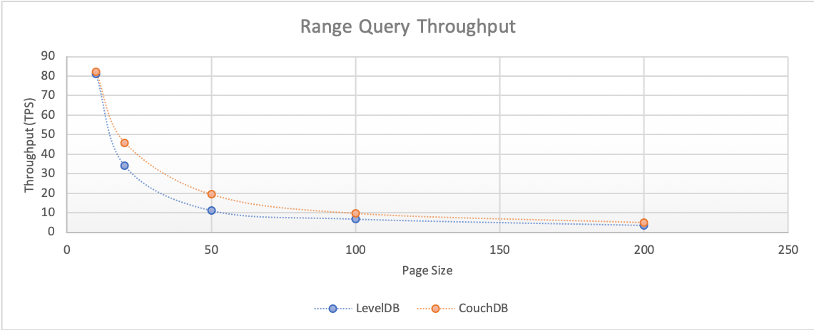
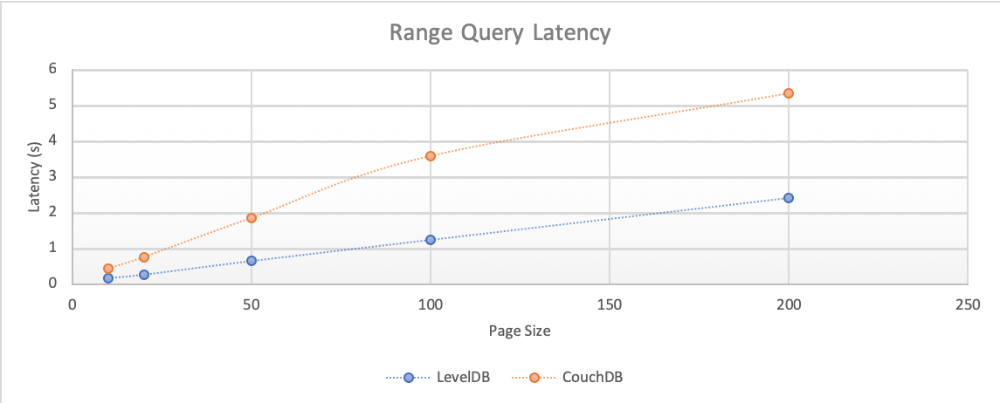
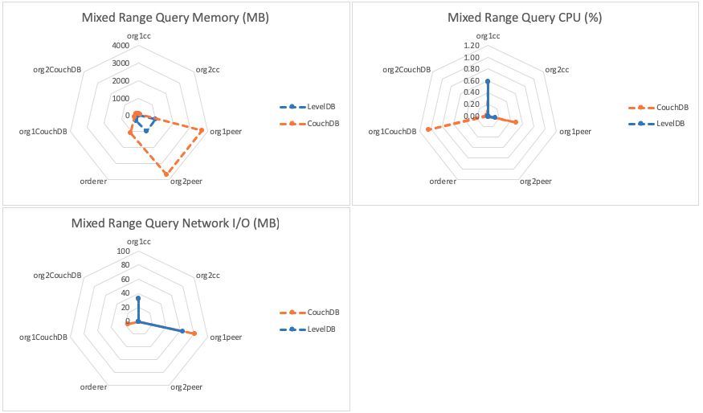

The paginated range query benchmark consists of evaluating `paginatedRangeQuery` gateway transactions for the fixed-asset smart contract deployed within LevelDB and CouchDB networks that use a 2-of-any endorsement policy. This will result in the method being run on a single Hyperledger Fabric Peer and will not result in any interaction with the Orderer. The investigated scenarios are targeted at reading from the world state database, resulting in the transaction pathway depicted in Figure 1.

*Figure 1: Evaluate Transaction Pathway*

Each transaction retrieves a fixed number of mixed byte size assets in the range [100, 1000, 2000, 4000, 8000, 16000, 32000, 64000] from the world state database.

Achievable throughput and associated latencies are investigated through maintaining a constant transaction backlog for each of the test clients. Successive rounds increase the page size of assets retrieved from the world state database.

Resource utilization is investigated for a fixed transaction rate of 30TPS and a batch size of 20 assets.

## Benchmark Results
*LevelDB*

| Page Size | Max Latency (s) | Avg Latency (s) | Throughput (TPS) |
| --------- | --------------- | --------------- | ---------------- |
| 10 | 0.23 | 0.16 | 81.1 |
| 20 | 0.37 | 0.26 | 34.0 |
| 50 | 0.86 | 0.64 | 11.2 |
| 100 | 1.59 | 1.23 | 6.8 |
| 200 | 2.86 | 2.40 | 3.6 |
| 500 | 9.02 | 7.07 | 0.9 |

*CouchDB*

| Page Size | Max Latency (s) | Avg Latency (s) | Throughput (TPS) |
| --------- | --------------- | --------------- | ---------------- |
| 10 | 0.94 | 0.42 | 82.1 |
| 20 | 1.60 | 0.75 | 45.9 |
| 50 | 4.09 | 1.84 | 19.4 |
| 100 | 8.03 | 3.57 | 9.7 |
| 200 | 16.55 | 5.32 | 5.0 |
| 500  | 15.96 | 4.80 | 1.6 |

*Resource Utilization- Batch Size 20 @30TPS*

## Benchmark Observations
Use of a CouchDB world state database enables greater throughput but higher latencies than the LevelDB equivalent.

In comparing the resource utilization of a LevelDB world state database with a CouchDB equivalent during a range query, the CouchDB world state incurs a cost in memory, network I/O and CPU utilization. In particular, use of a CouchDB world state for a range query is observed to result in significant increases in CPU and memory utilization in the peer, with an associated increase in network I/O as a result of communication with the CouchDB instance.

When comparing the range query page sizes against a matching batch size in the `Get Asset Batch Benchmark`, it is observed to be more efficient to use a batch retrieval mechanism with known UUIDs.