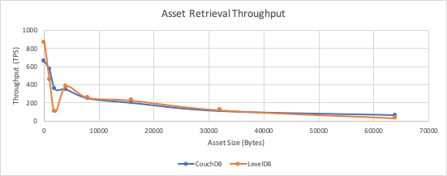
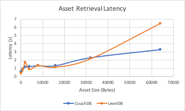
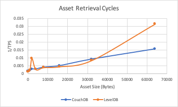

The asset retrieval benchmark consists of evaluating `getAsset` gateway transactions for the fixed-asset smart contract deployed within LevelDB and CouchDB networks that uses a 2-of-any endorsement policy. This will result in the method being run on a single Hyperledger Fabric Peer and will not result in any interaction with the Orderer. The investigated scenarios are targeted at reading from the world state database, resulting in the transaction pathway depicted in Figure 1.

*Figure 1: Evaluate Transaction Pathway*

Each transaction retrieves a single asset with a randomised UUID from the world state database.

Achievable throughput and associated latencies are investigated through maintaining a constant transaction backlog of 50 transactions for each of the 10 test clients running on LevelDB, and a constant transaction backlog of 100 transactions for each of the 10 test clients running on CouchDB.

## Benchmark Results
*LevelDB*

| Asset Size (bytes) | Max Latency (s) | Avg Latency (s) | Throughput (TPS) |
| ------------------ | --------------- | --------------- | ---------------- |
| 100 | 1.10 | 0.45 | 710.0 |
| 1K | 1.15 | 0.66 | 555.9 |
| 2K | 1.14 | 0.60 | 548.9 |
| 4K | 1.55 | 0.91 | 363.5 |
| 8K | 1.91 | 1.17 | 263.8 |
| 16K | 2.50 | 1.20 | 229.3 |
| 32K | 4.26 | 2.35 | 97.2 |
| 64K | 7.83 | 5.19 | 59.0 |

*CouchDB*

| Asset Size (bytes) | Max Latency (s) | Avg Latency (s) | Throughput (TPS) |
| ------------------ | --------------- | --------------- | ---------------- |
| 100 | 1.95 | 0.65 | 891.0 |
| 1K | 2.00 | 0.71 | 819.4 |
| 2K | 2.07 | 0.79 | 736.6 |
| 4K | 2.50 | 0.94 | 603.3 |
| 8K | 3.21 | 1.26 | 451.4 |
| 16K | 4.28 | 1.77 | 287.2 |
| 32K | 8.57 | 4.47 | 114.6 |
| 64K | 15.35 | 7.80 | 68.7 |

## Benchmark Observations
When compared with the CouchDB world state database, the LevelDB world state database is seen to achieve lower throughputs for smaller asset sizes and comparable throughputs for larger asset sizes. The LevelDB world state database achieves comparable transaction latencies at smaller asset sizes and lower transaction latencies at larger asset sizes compared to its CouchDB equivalent.
