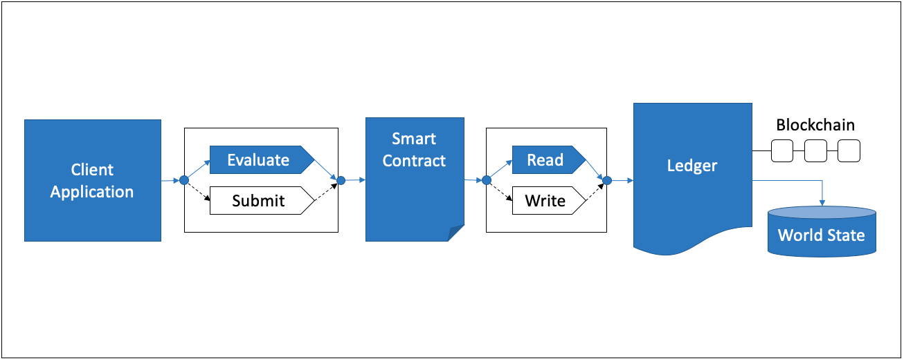

The paginated range query benchmark consists of evaluating `paginatedRangeQuery` gateway transactions for the fixed-asset smart contract deployed within LevelDB and CouchDB networks that use a 2-of-any endorsement policy. This will result in the method being run on a single Hyperledger Fabric Peer and will not result in any interaction with the Orderer. The investigated scenarios are targeted at reading from the world state database, resulting in the transaction pathway depicted in Figure 1.

*Figure 1: Evaluate Transaction Pathway*

Each transaction retrieves a fixed number of mixed byte size assets in the range [100, 1000, 2000, 4000, 8000, 16000, 32000, 64000] from the world state database.

## Benchmark Results
*CouchDB*

| Page Size | Max Latency (s) | Avg Latency (s) | Throughput (TPS) |
| --------- | --------------- | --------------- | ---------------- |
| 10	 | 1.78	 | 0.43	 | 127.6 |
| 20	 | 2.16	 | 0.54	 | 83.2 |
| 50	 | 2.67	 | 0.82	 | 44.8 |
| 100	 | 3.66	 | 1.27	 | 26.7 |
| 200	 | 4.36	 | 2.30	 | 14.7 |
| 300	 | 6.27	 | 3.45	 | 9.7 |

## Benchmark Configuration File

<details>
  <summary>Click to expand CouchDB Benchmark Configuration</summary>
  
```
workers:
  type: local
  number: 5
rounds:
  - label: mixed-range-query-evaluate-10
    description: >-
      Test an evaluateTransaction() Gateway method against the Go
      `fixed-asset` Smart Contract method named `paginatedRangeQuery`. This
      method performs a paginated range query, with a passed pagesize of 10 and
      a range keys that bound 200 assets created by the calling client.
    chaincodeID: fixed-asset
    txDuration: 300
    rateControl:
      type: fixed-backlog
      opts:
        unfinished_per_client: 10
    arguments:
      chaincodeID: fixed-asset
      create_sizes:
        - 100
        - 1000
        - 2000
        - 4000
        - 8000
        - 16000
        - 32000
        - 64000
      assets: 8000
      range: 200
      offset: 100
      pagesize: '10'
      nomatch: true
      consensus: false
    callback: benchmarks/api/fabric/lib/mixed-range-query-asset.js
  - label: mixed-range-query-evaluate-20
    description: >-
      Test an evaluateTransaction() Gateway method against the Go
      `fixed-asset` Smart Contract method named `paginatedRangeQuery`. This
      method performs a paginated range query, with a passed pagesize of 20 and
      a range keys that bound 200 assets created by the calling client.
    chaincodeID: fixed-asset
    txDuration: 300
    rateControl:
      type: fixed-backlog
      opts:
        unfinished_per_client: 10
    arguments:
      chaincodeID: fixed-asset
      range: 200
      offset: 100
      pagesize: '20'
      nosetup: true
      consensus: false
    callback: benchmarks/api/fabric/lib/mixed-range-query-asset.js
  - label: mixed-range-query-evaluate-50
    description: >-
      Test an evaluateTransaction() Gateway method against the Go
      `fixed-asset` Smart Contract method named `paginatedRangeQuery`. This
      method performs a paginated range query, with a passed pagesize of 50 and
      a range keys that bound 200 assets created by the calling client.
    chaincodeID: fixed-asset
    txDuration: 300
    rateControl:
      type: fixed-backlog
      opts:
        unfinished_per_client: 10
    arguments:
      chaincodeID: fixed-asset
      range: 200
      offset: 100
      pagesize: '50'
      nosetup: true
      consensus: false
    callback: benchmarks/api/fabric/lib/mixed-range-query-asset.js
  - label: mixed-range-query-evaluate-100
    description: >-
      Test an evaluateTransaction() Gateway method against the Go
      `fixed-asset` Smart Contract method named `paginatedRangeQuery`. This
      method performs a paginated range query, with a passed pagesize of 100 and
      a range keys that bound 200 assets created by the calling client.
    chaincodeID: fixed-asset
    txDuration: 300
    rateControl:
      type: fixed-backlog
      opts:
        unfinished_per_client: 10
    arguments:
      chaincodeID: fixed-asset
      range: 200
      offset: 100
      pagesize: '100'
      nosetup: true
      consensus: false
    callback: benchmarks/api/fabric/lib/mixed-range-query-asset.js
  - label: mixed-range-query-evaluate-200
    description: >-
      Test an evaluateTransaction() Gateway method against the Go
      `fixed-asset` Smart Contract method named `paginatedRangeQuery`. This
      method performs a paginated range query, with a passed pagesize of 200 and
      a range keys that bound 200 assets created by the calling client.
    chaincodeID: fixed-asset
    txDuration: 300
    rateControl:
      type: fixed-backlog
      opts:
        unfinished_per_client: 10
    arguments:
      chaincodeID: fixed-asset
      range: 200
      offset: 100
      pagesize: '200'
      nosetup: true
      consensus: false
    callback: benchmarks/api/fabric/lib/mixed-range-query-asset.js
  - label: mixed-range-query-evaluate-300
    description: >-
      Test an evaluateTransaction() Gateway method against the Go
      `fixed-asset` Smart Contract method named `paginatedRangeQuery`. This
      method performs a paginated range query, with a passed pagesize of 500 and
      a range keys that bound 200 assets created by the calling client.
    chaincodeID: fixed-asset
    txDuration: 300
    rateControl:
      type: fixed-backlog
      opts:
        unfinished_per_client: 10
    arguments:
      chaincodeID: fixed-asset
      range: 200
      offset: 100
      pagesize: '300'
      nosetup: true
      consensus: false
    callback: benchmarks/api/fabric/lib/mixed-range-query-asset.js
  - label: mixed-range-query-evaluate-20-fixed-tps
    description: >-
      Test an evaluateTransaction() Gateway method against the Go
      `fixed-asset` Smart Contract method named `paginatedRangeQuery`. This
      method performs a paginated range query, with a passed pagesize of 20 and
      a range keys that bound 200 assets created by the calling client at a
      fixed TPS.
    chaincodeID: fixed-asset
    txDuration: 300
    rateControl:
      type: fixed-rate
      opts:
        tps: 10
    arguments:
      chaincodeID: fixed-asset
      range: 200
      offset: 100
      pagesize: '20'
      nosetup: true
      consensus: false
    callback: benchmarks/api/fabric/lib/mixed-range-query-asset.js
```
</details>